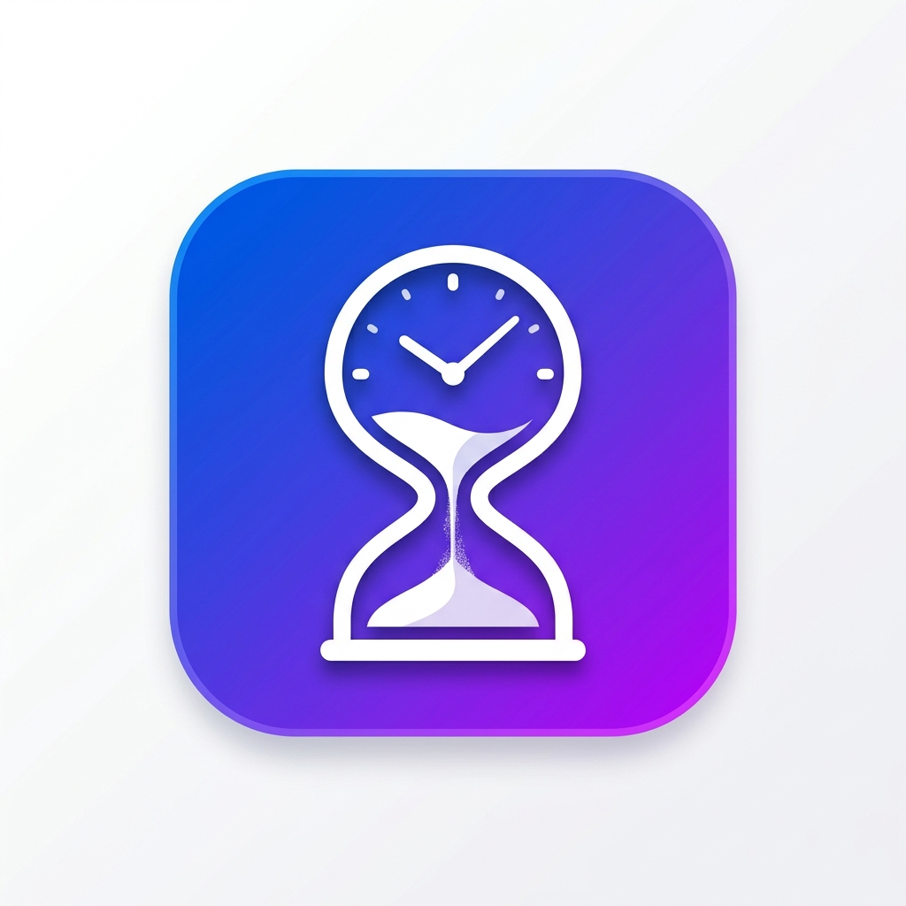

<p align="center">
  
</p>

<h1 align="center">Screen Timeout Tile</h1>

<p align="center">
  <em>Temporarily extend your screen timeout in one tap — right from Quick Settings.</em>
</p>

<p align="center">
  <a href="https://rohit8149.github.io/ScreenTimeoutTile/ScreenTimeoutTile.apk">
    
  </a>
</p>

---

## 🤔 The Problem

You're reading a long article, following a recipe, or showing someone your screen — and your phone keeps turning off every minute. Going into **Settings → Display → Screen Timeout** every time is annoying.

## 💡 The Solution

**Screen Timeout Tile** adds a Quick Settings tile that lets you temporarily boost your screen timeout to **5, 10, or 30 minutes** with a single tap. When you're done, it restores your exact original timeout automatically.

---

## ✨ Features

| | Feature | Description |
|---|---|---|
| ⚡ | **Quick Settings Tile** | Toggle directly from your notification shade — no need to open the app |
| 🔄 | **Smart Cycle** | Tap to cycle: `Original` → `5 min` → `10 min` → `30 min` → `Original` |
| 🔋 | **Zero Battery Drain** | No background polling — just changes a system setting and sleeps |
| 🔔 | **Smart Notification** | Shows active timeout. Swipe it away to instantly restore your original timeout |
| 🔒 | **Remembers Your Settings** | Saves and restores your exact original timeout, even after reboot |
| 🚫 | **No Ads, No Tracking** | Completely free, open source, and private |

---

## 📥 Download

<a href="https://rohit8149.github.io/ScreenTimeoutTile/ScreenTimeoutTile.apk">
  
</a>

> You can also visit the [download page](https://rohit8149.github.io/ScreenTimeoutTile/) on your phone for a smooth download experience.

---

## 📱 How to Use

### Step 1 — Install & Grant Permission
Open the app once after installing. It will ask you to allow **"Modify system settings"** — this is required so the app can change your screen timeout.

### Step 2 — Add the Tile
Swipe down from the top of your screen to open Quick Settings. Tap the **edit (✏️) icon**, find **"Screen Timeout"** and drag it into your active tiles.

### Step 3 — Tap to Cycle
Each tap on the tile cycles through temporary timeouts:

```
Your Timeout → 5 min → 10 min → 30 min → Your Timeout
```

### Step 4 — Restore
To go back to your normal timeout:
- **Tap the tile** until it cycles back, OR
- **Swipe away the notification** — this instantly restores your original timeout

That's it! You never need to open the app again. Everything works from the tile and notification.

---

## 🛠️ Built With

- **Kotlin** — Modern Android development language
- **Jetpack Compose** — For the clean onboarding UI
- **Android TileService API** — For the native Quick Settings integration
- **Android Foreground Service** — For reliable notifications on Android 14+

---

## 🏗️ Building from Source

```bash
git clone https://github.com/Rohit8149/ScreenTimeoutTile.git
cd ScreenTimeoutTile
./gradlew assembleDebug
```

The APK will be at `app/build/outputs/apk/debug/app-debug.apk`

---

<p align="center">
  Made with ❤️ by <a href="https://github.com/Rohit8149">Rohit</a>
</p>
